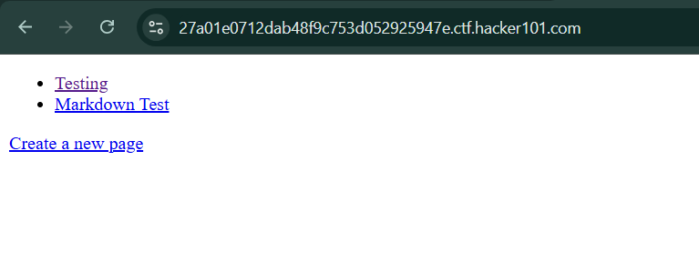
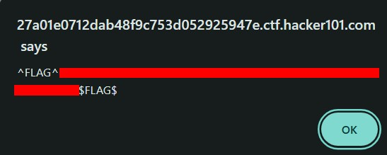
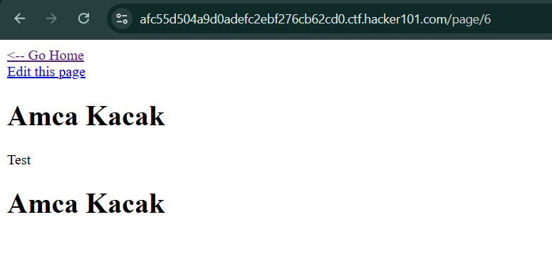
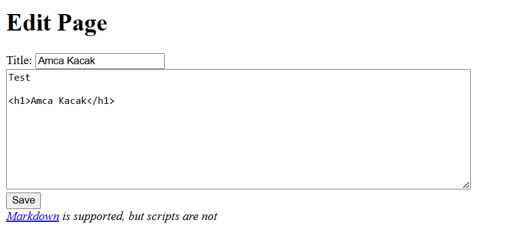
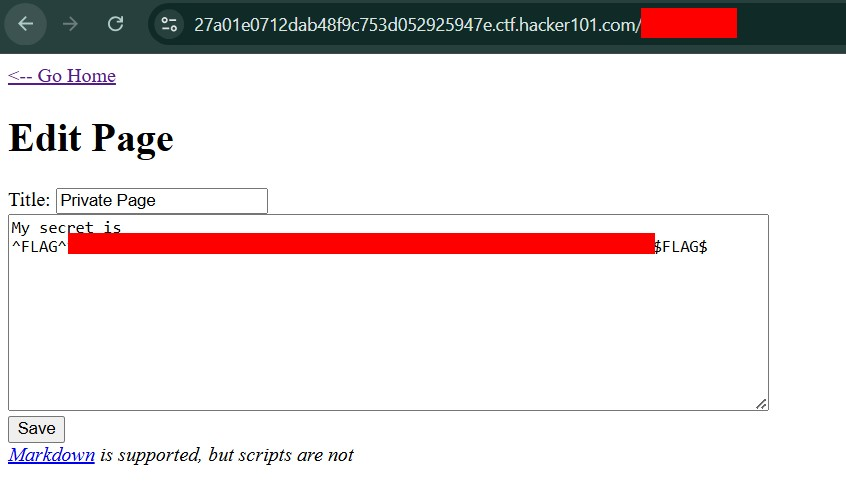
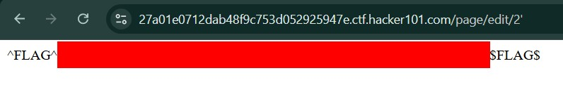
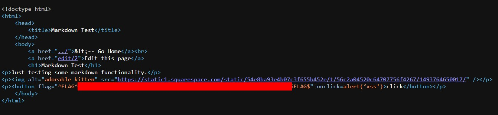

# Flag 1 : Cross Site Scripting ( XSS )

At first we've been redirect to a simple webpage ,try to explore the site, but found nothing only `testing page` ,`Markdown Test` and `Creating a new page`



so I try to edit the `Testing Page` by add the XSS Payload on the title then go back to homepage and you'll get the flag



# Flag 2 : Unauthorized Access

When I created the first page , I noticed it was assigned an id of 6



When I visit the two pages provided before, I noticed that the pages have an id of 1 and 2. which means there must be another pages with a different id. So I go around by changing the `id` from `1` to `10` but found nothing.

So I try explore everything on the web and found that the `edit page also have id `



Just like before , I changing the `id` from `1` to `10`, and found the 2nd flag 



# Flag 3 : SQL Injection 

Since all pages refer an `id` I try to test it with a `single quote (')` and somehow reveal the third flag



# Flag 4 : Stored XSS


See that `Markdown is supported, but scripts are not` means we have to find a way to bypass the markdown filter to execute xss to get the flag. Noticed the button code ? let's input XSS Payload in it

```XSS Payloads
<button onclick=alert(‘xss’)>click</button>
```

The payload execute nicely but nothing showed up, try to view the source code and you'll find the flag



# Conclusion

In conclusion this chall really teach about common Vulnerabilities that goes around and still relevant on this modern world
> Anjai speaking


# Happy Hacking


